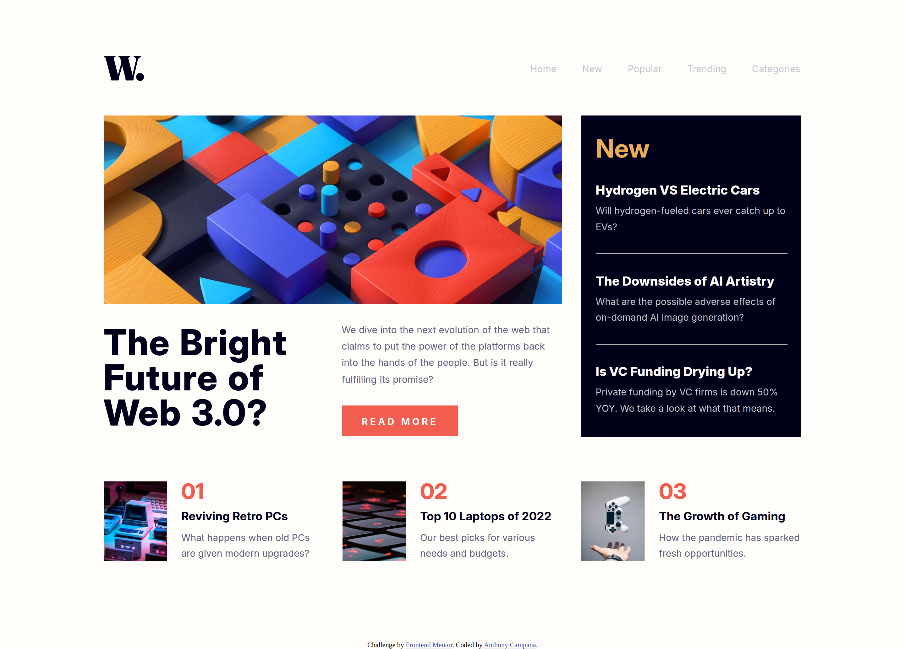
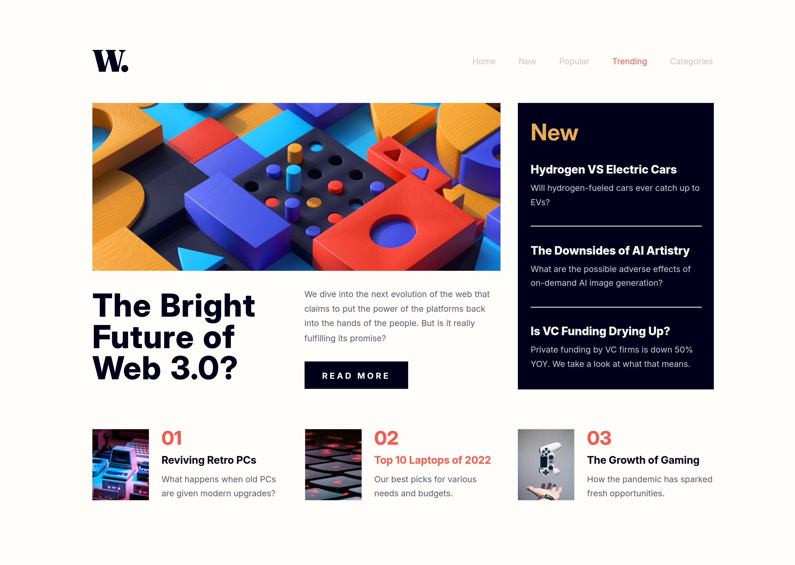
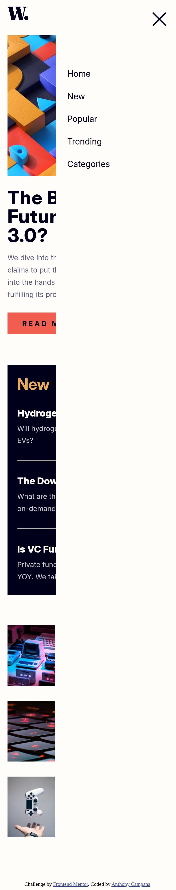

# Frontend Mentor - News homepage solution

This is a solution to the [News homepage challenge on Frontend Mentor](https://www.frontendmentor.io/challenges/news-homepage-H6SWTa1MFl). Frontend Mentor challenges help you improve your coding skills by building realistic projects. 

## Table of contents

- [Overview](#overview)
  - [The challenge](#the-challenge)
  - [Screenshot](#screenshot)
  - [Links](#links)
- [My process](#my-process)
  - [Built with](#built-with)
  - [What I learned](#what-i-learned)
  - [Useful resources](#useful-resources)
- [Author](#author)

## Overview

### The challenge

Users should be able to:

- View the optimal layout for the interface depending on their device's screen size
- See hover and focus states for all interactive elements on the page

### Screenshot

#### Desktop

#### Mobile

### Links

- Solution URL: [solution URL](https://your-solution-url.com)
- Live Site URL: [live site URL](https://your-live-site-url.com)

## My process

### Built with

- Semantic HTML5 markup
- CSS custom properties
- Flexbox
- Mobile-first workflow
- [SASS](https://sass-lang.com/) - CSS preprocessor
- [JQuery](https://jquery.com/) - JS library

### What I learned

From this project I was able to learn how to make a side menu appear overlaying the html tags already visible.

### Useful resources

- [Mozilla Documentation](https://www.example.com) - This helped me by providing insight on html tags and css properties
- [SASS Documentation](https://sass-lang.com/) - This helped me by giving documentationto understand how sytanx for .sass file works
- [JQuery Documentation](https://jquery.com/) - This helped me by providing documentation on how to add effects on html tags

## Author

- Website - [Anthony Campana](https://anthonycampana.pythonanywhere.com/)
- Frontend Mentor - [@AnthonyCampana](https://www.frontendmentor.io/profile/AnthonyCampana)

